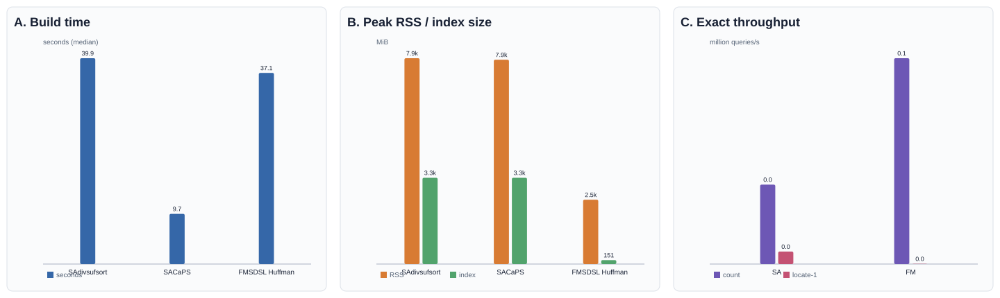

# Benchmarks

<!-- SUFKIT_HEADLINE_START -->
## Latest completed-stage server snapshot

256 MiB synthetic `mixed` genome, 4 contigs, seed `20260822`; exact 100 bp, forward, locate-1; maximum-right-match query length 256 bp and minimum length 50 bp.

### Construction

| Index | Builder | Threads | Build time | Peak RSS | Index size | bits/base |
|---|---:|---:|---:|---:|---:|---:|
| SA / divsufsort | divsufsort | 1 | 39.93 s | 7,939.48 MiB | 3,328.00 MiB | 104.00 |
| SA / CaPS | CaPS | 64 | 9.73 s | 7,880.95 MiB | 3,328.00 MiB | 104.00 |
| FM / SDSL Huffman | SDSL Huffman | 1 | 37.08 s | 2,479.61 MiB | 151.20 MiB | 4.72 |

### Exact count and locate-1

| Index | Operation | Throughput | ns/query | Query peak RSS |
|---|---:|---:|---:|---:|
| SA32 default | Count | 0.0331 M queries/s | 30,231.15 | 5,669.24 MiB |
| SA32 default | Locate-1 | 0.0052 M queries/s | 192,263.03 | 5,669.35 MiB |
| FM Huffman | Count | 0.0858 M queries/s | 11,661.33 | 431.54 MiB |
| FM Huffman | Locate-1 | 0.0001 M queries/s | 11,428,852.73 | 431.55 MiB |

### Maximum right matches

| Method | Query throughput | Matches/s | Speedup | Repetitions |
|---|---:|---:|---:|---:|
| SA baseline | 0.189 M bases/s | 1,352.86 | 1.00x | 3 |
| SA suffix-link default | 1.123 M bases/s | 8,027.63 | 5.93x | 3 |



Headline exact uses dedicated 3-build/5-query runs; maximum-right-match uses the audited full/mixed 3-query run because the dedicated headline right-maximal stage was excluded. Standard and full are representative mixed experiments, not full six-scenario scans.

[Completed-stage result snapshot](results/server-205023a-representative-20260824/README.md)
<!-- SUFKIT_HEADLINE_END -->

The V1 benchmark is compiled into the `sufkit bench` command so the same
installed executable can measure generated or user-supplied genome data.
Its implementation is split across `apps/benchmark*.cpp`; the benchmark
contract, TSV schema, correctness gate, and invocation examples are documented in
`docs/benchmarks/methodology.md`.

Use the smoke profile for a fast correctness check:

```bash
./build/release/sufkit bench \
  --profile smoke \
  --output-dir build/bench/smoke
```

Run the fixed approximately 4 MiB profile explicitly when performance numbers
are needed:

```bash
./build/release/sufkit bench \
  --profile quick \
  --output-dir build/bench/quick
```

`standard` and `full` are opt-in large profiles. User FASTA input is accepted
with `--reference` and optional `--queries`; the benchmark never downloads a
dataset automatically.

Parallel suffix-array construction has a separate executable so CaPS work does
not couple to the unified query benchmark:

```bash
./build/release/sufkit_sa_build_bench \
  --profile quick \
  --methods div32,caps32 \
  --threads 1,2,4,8 \
  --acceleration none \
  --output-dir build/bench/sa-quick
```

See `docs/benchmarks/sa-construction-methodology.md` for timing boundaries and
TSV fields, and `docs/benchmarks/results/unreleased-caps.md` for the measured
smoke/quick results. Sampled-SA methodology and measurements are documented in
`docs/benchmarks/results/unreleased-sampled-sa.md`.

## Publishing a packaged headline

After a complete result package has been copied below `benchmarks/results`,
render the managed section at the top of this file directly from its TSVs:

```bash
python3 -B benchmarks/update_benchmark_readme.py \
  --package-dir benchmarks/results/server-REVISION-YYYYMMDD

python3 -B benchmarks/update_benchmark_readme.py \
  --package-dir benchmarks/results/server-REVISION-YYYYMMDD \
  --check
```

The updater accepts the runner's strict `profile-audit` correctness shape and,
for separately packaged local runs, only an equivalently complete non-strict
headline audit. It requires the exported-reference identity gate, rejects
partial packages, failed checks, missing provenance, incomplete repetition
evidence, and a missing headline raw-completeness gate. The publication
contract contains 11 base correctness checks plus 12 headline audit checks.
Do not edit or copy numeric values inside the managed marker region by hand.
