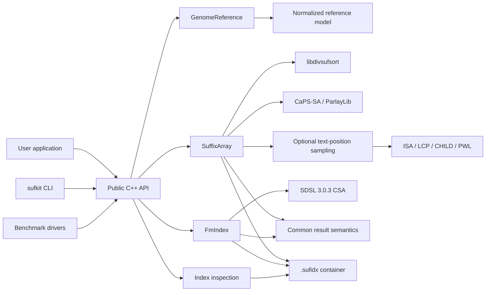
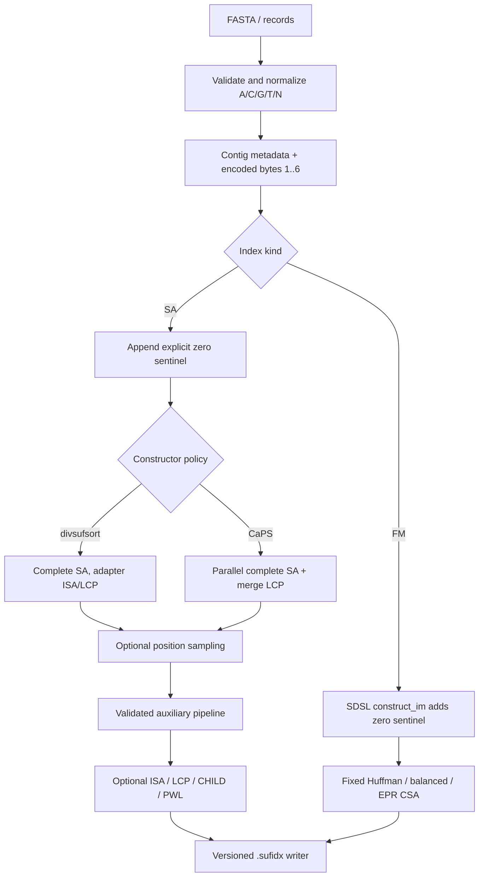
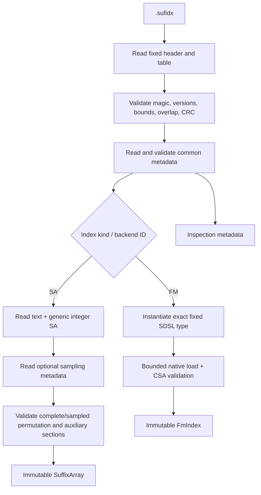

# Architecture

sufkit separates a small, stable C++ surface from backend-heavy construction,
query, and serialization code. Third-party templates and headers stay behind
PIMPL boundaries.

## Component map

The public API depends on standard C++ types. `SuffixArray` and `FmIndex`
choose private implementations after construction/load. The common semantics
layer owns encoding, strand expansion, coordinate mapping, sorting, merging,
and truncation rules shared across backends.

## Module responsibilities

| Module | Responsibility | Must not own |
|---|---|---|
| `include/sufkit` | Stable declarations, options, results, errors | Third-party implementation types |
| Reference layer | FASTA, normalization, metadata, encoded text, fingerprint | Index-specific structures |
| Query utilities | Exact pattern encoding, reverse complement, deterministic result finalization | SA/FM traversal |
| Suffix-array layer | Constructor dispatch, SA storage, ISA/LCP/CHILD/PWL, exact and right-maximal exact match | SDSL CSA internals |
| FM layer | Fixed SDSL variants, scalar/batch backward search, CSA locate | Custom C/Occ/LF/rank/select |
| Serialization | Outer container, CRC, bounded sections, atomic publication | Algorithm policy |
| Inspection | Validate/report persisted metadata and compiled backend availability | Query construction |
| CLI | Argument validation, FASTA query ingestion, TSV output, exit mapping | Hidden alternative semantics |
| Benchmark | Deterministic data, process isolation, correctness gates, summaries | Production API changes |

## Index build data flow

CaPS and divsufsort first produce the same complete suffix order. CaPS can
return its merge-built LCP; the divsufsort adapter can return generalized
Kasai ISA/LCP. Optional sampling compacts rows before the remaining auxiliary
pipeline. Persisted invariants and query results remain constructor
independent even though phase ownership differs.

## Query data flow

Queries are encoded and expanded by strand before backend dispatch. Complete
SA exact search chooses binary, LCP-aware binary, eligible PWL, or explicit
CHILD; sampled SA recovers residue classes; FM search calls the selected SDSL
CSA. Every path converges on common boundary validation, contig mapping,
sorting, strand merging, and retention logic.

Right-maximal search exists only on standalone SA. It splits a query into
canonical runs, initializes or reuses a suffix interval, extends candidates,
verifies exactness and right maximality, and emits through the common stream or
bounded-vector layer. Sampled recovery changes the anchor domain, not output
semantics. Detailed traversal rules are maintained in
[algorithm internals](algorithm-internals.md).

## Load and inspection flow

Inspection shares the container validator but does not construct query-facing
third-party state. Unknown or damaged required data is never silently ignored.

## Ownership and concurrency

- `GenomeReference` owns normalized input during construction.
- An index copies required metadata/payload and does not retain a FASTA path.
- Build temporaries such as construction input or temporary ISA are released
  after the final structure is formed.
- Public index objects are move-only, preventing accidental expensive copies.
- Const queries are concurrent. Mutable caller-owned statistics are outside
  that guarantee.
- Synchronous right-maximal exact match callbacks execute on the calling thread.

## Dependency direction

Allowed direction is public API → internal model/query/serialization → backend
implementation. Backends may use common encoding and metadata but must not
invent different public coordinate or strand semantics. CLI and benchmarks
consume the library; the library never depends on application-layer code.

Read [algorithm internals](algorithm-internals.md) before changing any arrow in
these diagrams.
